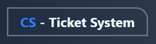
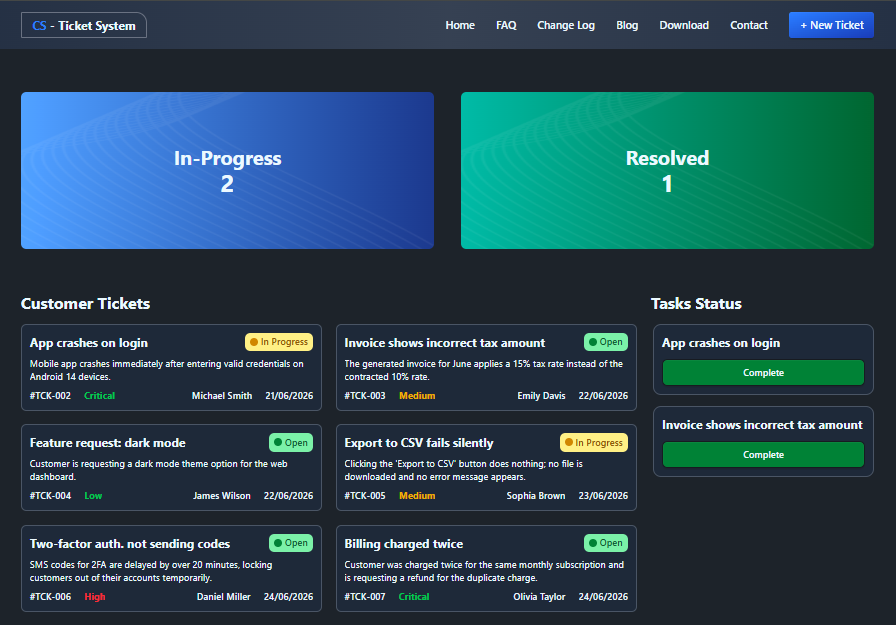
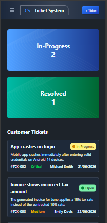

# Customer Support Zone

A responsive React application that helps manage customer support tickets through an interactive workflow. Users can assign tickets to a task list, resolve them, and track ticket progress with real-time statistics and toast notifications.

------------------------------------------------------------------------

## Overview

**Customer Support Zone** is a simple ticket management system built with React. It allows users to organize customer support requests efficiently by moving tickets through different stages.

The application provides an interactive experience where users can:

- View customer support tickets loaded from local JSON data
- Add tickets to the **Task Status** section
- Prevent duplicate task assignments
- Complete tasks with a single click
- Automatically move completed tickets to the resolved list
- Track **In Progress** and **Resolved** ticket counts in real time
- Receive instant feedback using **React Toastify**
- Enjoy a fully responsive interface across desktop, tablet, and mobile devices

------------------------------------------------------------------------

## Live Demo

🔗 [View Live Demo](https://project-customer-support-zone.netlify.app/)

------------------------------------------------------------------------

## Tech Stack

| Layer | Technology |
|--------|------------|
| Frontend | React.js |
| Styling | Tailwind CSS, DaisyUI |
| Notifications | React Toastify |
| Language | JavaScript (ES6+) |
| Data Source | Local JSON |
| Build Tool | Vite |

------------------------------------------------------------------------

## Features

### Ticket Dashboard

- Display all customer support tickets from a local JSON file
- Show ticket title, description, customer name, priority, status, and created date
- Responsive ticket card layout

### Banner Statistics

- Display live ticket statistics
- Track **In Progress** tickets
- Track **Resolved** tickets
- Automatically update counts after every action

### Task Status

- Add tickets to the Task Status section
- Prevent duplicate ticket assignments
- Display selected tickets with a **Complete** button

### Task Completion

- Complete tickets with a single click
- Remove completed tickets from Task Status
- Remove completed tickets from Customer Tickets
- Add completed tickets to the Resolved list
- Automatically update ticket statistics

### Smart Validation

- Prevent duplicate ticket selection
- User-friendly notifications using **React Toastify**
- Real-time UI updates without page refresh

### Responsive Design

- Responsive Navbar
- Responsive Banner
- Responsive Ticket Cards
- Responsive Task Status Section
- Responsive Footer

------------------------------------------------------------------------

## Key Highlights

- Built with React functional components
- Dynamic ticket rendering from local JSON
- Real-time ticket statistics
- Complete ticket management workflow
- Duplicate task prevention
- React Toastify notifications
- Reusable component architecture
- Fully responsive UI

------------------------------------------------------------------------

## UI Screenshots

### Home Page

### Mobile View

------------------------------------------------------------------------

## Future Improvements

- Save ticket progress using Local Storage
- Search tickets by title or customer
- Filter by priority and status
- Sort tickets by created date
- Dark mode
- Backend API integration
- User authentication
- Drag-and-drop task management

------------------------------------------------------------------------

## Author

**A S M Saim**

- GitHub: [@asm-saim](https://github.com/asm-saim)
- LinkedIn: [A S M Saim](https://www.linkedin.com/in/asmsaim/)